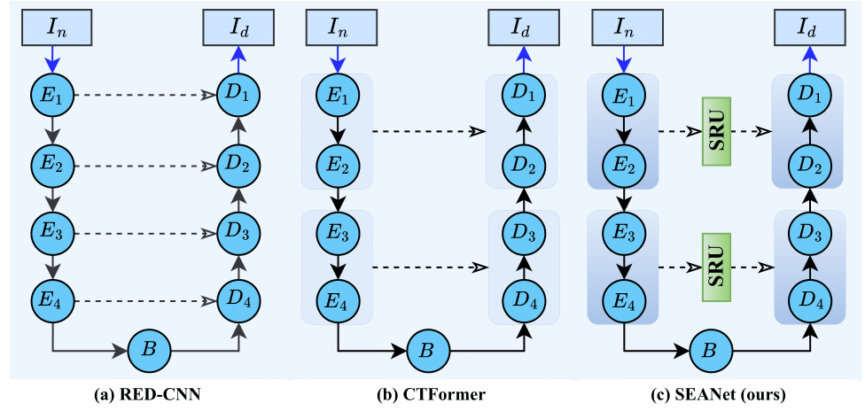

# 🌟 SEANet: Rethinking Skip-connections Design in Encoder-decoder Networks via Synergistic Spatial-Spectral Fusion for LDCT Denoising

## 🏆 Introduction

Welcome to the official repository for **SEANet**, presented in our paper titled **"SEANet: Rethinking Skip-connections Design in Encoder-decoder Networks via Synergistic Spatial-Spectral Fusion for LDCT Denoising"** 📝, accepted at the **27th International Conference of Pattern Recognition** 🎉.

In the realm of medical imaging, low-dose CT (LDCT) is the go-to choice over normal-dose CT (NDCT) due to its reduced radiation risks ⚡. However, the noise introduced in LDCT images requires sophisticated denoising techniques. Traditional methods like iterative reconstruction algorithms often struggle with the delicate balance between noise reduction and preserving fine details 🖼️. Recent approaches using CNNs and transformers have made strides, but still face challenges such as loss of semantic details and difficulty in accurately focusing on patch edges.

To overcome these limitations, we introduce **SEANet** 🛠️, a cutting-edge architecture that integrates spectral residual units (SRUs) with encoder-decoder frameworks, synergizing both spatial and spectral spaces 🌐. SEANet excels in separating noise from relevant features, enhancing denoising performance, particularly in low-contrast regions of LDCT images.

## 🧠 Abstract

In medical imaging, low-dose CT (LDCT) is favored over normal-dose CT (NDCT) to reduce radiation risks, but LDCT suffers from increased noise, prompting the need for advanced denoising techniques. Traditional iterative reconstruction algorithms face challenges in balancing noise reduction and preserving fine details, whereas recent CNN or transformer-based methods learn mappings from noisy to clean images incorporating encoder-decoder architectures with skip-connections. Conventional skip connections with vanilla convolutions lead to loss of semantic details in deeper layers, while transformer-based methods may struggle to focus on patch edges and exhibit limited efficacy capturing local representations precisely with limited data. To establish the balance between feature retention and noise reduction, we introduce SEANet, a novel architecture integrating spectral residual units (SRUs) with encoder-decoder frameworks, synergizing complementary spatial and spectral spaces. In SEANet, SRUs guide the corresponding decoder blocks with synergistic local-to-global features via skip-connections. SRUs with encoding dilation modules (DMs) precisely separate noise from relevant features by distinct frequency bands in spectral space and attend to patch-edges well. SEANet eliminates the drawback of spatial pooling and facilitates precise denoising for low contrast regions in LDCT images. Extensive experiments and interpretable spectral maps demonstrate SEANet's superiority over state-of-the-art methods like RED-CNN and CTFormer with a margin of 1.92 in PSNR and 2.75 in SSIM.

## 🌍 Key Contributions

Our contributions in this paper are summarized as the following:

1. **SEANet Architecture:** We propose SEANet that utilizes spectral residual units (SRUs) within encoder-decoder architectures, synergizing spatial and spectral domains. Multiscale learning in spectral space complements the spatial features extracted from each encoding block 🎯.

2. **Denoising Precision:** SRU along with dilation modules (DMs) enables precise separation of noise from relevant anatomical features in spectral space by distinct frequency signatures and attends to edges for all patches. This facilitates precise denoising for low-contrast regions and mitigates the limitations of spatial pooling 🎨.

3. **Performance:** SEANet is evaluated on the largest publicly available Mayo LDCT dataset across five different metrics with in-depth spectral map analysis. SEANet outperforms existing state-of-the-art (SOTA) methods with a margin of 2.75 in structural similarity index (SSIM) and 8.93 in mean absolute percentage error (MAPE) 📊.

## 📸 Visual Overview

Here are some key images that illustrate the SEANet architecture and its comparison with existing methods:

*📷 Fig 1: An illustration showing the different skip-connection schemes implemented in existing denoising methods against proposed SEANet model with synergistic residual.*

*📷 Fig 2: Holistic architecture of proposed SEANet.*

## 🚀 Code and Data

The code for training, inference, and the associated checkpoints will be coming soon to this repository. Stay tuned! 🔜

## 📝 License

This project is licensed under the MIT License - see the [LICENSE](LICENSE) file for details.
